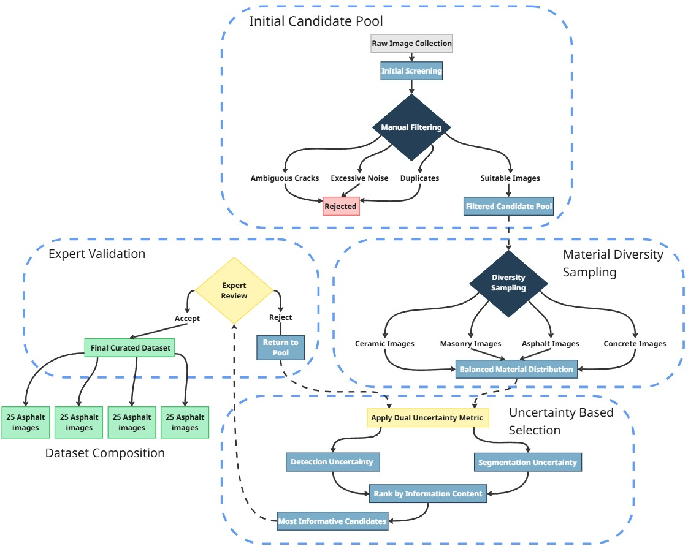

# 🏗️ Smart Infrastructure Inspector
### Advanced Crack Detection Framework using Foundation Models Integration

[-blue)](https://drive.google.com/file/d/1-wbn4BUKsbLLQe9Rw_4Rgh3M9gt6z2AN/view?usp=sharing)
[](link-to-huggingface)
[](LICENSE)
[](https://www.python.org/)
[](https://pytorch.org/)

## 🎯 Project Highlights

**State-of-the-art crack detection** achieving **92.3% precision** and **72% mIoU** through innovative integration of three complementary foundation models:

- 🔍 **SAM2** for precise instance segmentation
- 📷 **Florence2** for robust feature detection  
- 🎨 **Stable Diffusion XL** for data enhancement

### Key Achievements
- ⚡ **40% faster** than comparable methods (2.3s per 1024×1024 image)
- 📊 **72% mIoU** after only 3 active learning cycles
- 🎯 **92.3% detection accuracy** across diverse materials
- 🔄 **Cross-material generalization** (concrete, asphalt, masonry, ceramic)

## 📺 Demo

Try our live demo on Hugging Face Spaces: [**Launch Demo →**](link-to-demo)


## 🚀 Quick Start

### Installation

```bash
# Clone the repository
git clone https://github.com/yourusername/smart-infrastructure-inspector.git
cd smart-infrastructure-inspector

# Create conda environment
conda create -n crack-detection python=3.9
conda activate crack-detection

# Install dependencies
pip install -r requirements.txt
```

### Basic Usage

```python
from crack_detector import SmartInfrastructureInspector

# Initialize the framework
inspector = SmartInfrastructureInspector(
    device='cuda',
    models_path='./checkpoints'
)

# Detect cracks in an image
results = inspector.detect('path/to/image.jpg')

# Visualize results
inspector.visualize_results(results, save_path='output.jpg')
```

## 📁 Repository Structure

```
smart-infrastructure-inspector/
│
├── 📊 data/
│   ├── sample_images/        # Example images for testing
│   └── dataset_info.md        # Dataset documentation
│
├── 🧠 models/
│   ├── sam2/                  # SAM2 integration
│   ├── florence2/             # Florence2 detection
│   └── sdxl/                  # SDXL enhancement
│
├── 🔧 src/
│   ├── crack_detector.py      # Main detection pipeline
│   ├── active_learning.py     # Active learning module
│   ├── data_augmentation.py   # Synthetic data generation
│   └── utils/                 # Helper functions
│
├── 📓 notebooks/
│   ├── 01_data_preparation.ipynb
│   ├── 02_model_training.ipynb
│   ├── 03_evaluation.ipynb
│   └── 04_demo_walkthrough.ipynb
│
├── 🎮 demo/
│   ├── app.py                 # Gradio demo application
│   └── requirements.txt       # Demo dependencies
│
├── 📈 results/
│   ├── performance_metrics.md
│   ├── ablation_studies/
│   └── visualizations/
│
├── 📚 docs/
│   ├── ARCHITECTURE.md        # System architecture
│   ├── TRAINING.md            # Training guide
│   └── API.md                 # API documentation
│
├── 🧪 tests/
│   └── test_detection.py
│
├── requirements.txt
├── LICENSE
└── README.md
```

## 🔬 Methodology

### Foundation Models Integration

Our framework synergistically combines three state-of-the-art foundation models:

1. **SAM2 (Segment Anything Model 2)**
   - Provides precise instance-level segmentation
   - Fine-tuned prompt encoder and mask decoder
   - Achieves 77.2% Dice coefficient

2. **Florence2**
   - Robust crack detection across materials
   - Generates high-quality region proposals
   - 92.3% detection precision

3. **Stable Diffusion XL**
   - Enhances low-resolution images
   - Generates synthetic training data
   - LoRA fine-tuning for domain adaptation

### Active Learning Pipeline



## 📊 Performance Results

### Detection Performance
| Material | Precision | Recall | F1-Score | Accuracy |
|----------|-----------|--------|----------|----------|
| Concrete | 94.2% | 91.5% | 92.8% | 93.1% |
| Asphalt | 93.7% | 90.2% | 91.9% | 92.4% |
| Masonry | 90.8% | 87.6% | 89.2% | 90.1% |
| Ceramic | 90.5% | 89.4% | 89.9% | 90.3% |
| **Overall** | **92.3%** | **89.7%** | **91.0%** | **91.5%** |

### Segmentation Quality
| Metric | Initial | After AL Cycle 3 | Improvement |
|--------|---------|------------------|-------------|
| mIoU | 63.0% | 72.0% | +9.0% |
| Dice | 77.2% | 84.1% | +6.9% |
| Boundary F1 | 68.1% | 75.3% | +7.2% |

## 🎓 Citation

If you use this work in your research, please cite:

```bibtex
@article{verdugo2025datacentric,
  title={A Data-Centric Framework for Automated Crack Instance Segmentation 
         in Construction Materials via Integration of Foundational Vision Models},
  author={Verdugo-Siqueiros, R. Daniel and Pellegrin, Luis and 
          Gonzalez-Fraga, Jose Angel},
  journal={Neural Computing and Applications},
  year={2025},
  status={Under Review}
}
```

## 🤝 Contributing

We welcome contributions! Please see [CONTRIBUTING.md](docs/CONTRIBUTING.md) for guidelines.

## 📄 License

This project is licensed under the MIT License - see [LICENSE](LICENSE) file for details.


## 📧 Contact

**Roberto Daniel Verdugo Siqueiros**
- Email: verdugo.rds@gmail.com
- LinkedIn: [Connect with me](https://www.linkedin.com/in/rdverdugo/)

---

  Made with ❤️ for infrastructure safety
